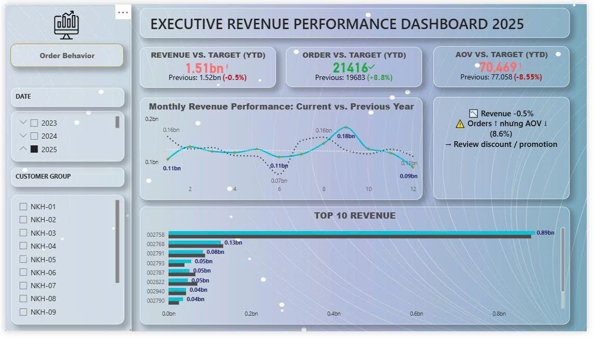
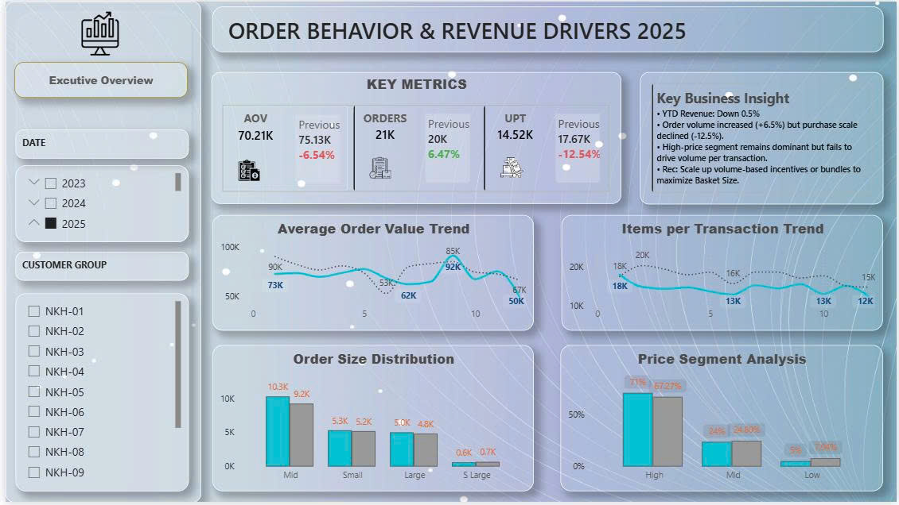
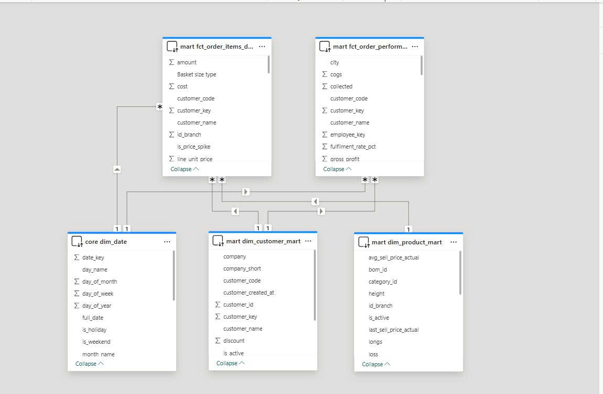

# ERP Data Warehouse (erp-dwh-td)

> Dự án cá nhân — Xây dựng hệ thống Data Warehouse hoàn chỉnh để tự động hóa báo cáo từ dữ liệu ERP thực tế.
> **Kết quả then chốt:** Tự động hóa **85% thời gian** báo cáo (từ 4h xuống 15 phút), phát hiện **20 tỷ VND WIP** tồn đọng, và tối ưu hóa AOV thông qua phân tích tập khách hàng.
> **Stack:** MySQL (Source) → Python (ELT) → PostgreSQL (Star Schema) → dbt (Models) → Power BI (Insights)

---

## 1. Kết quả & Tác động Kinh doanh (Key Impact)

Dự án này không chỉ là một pipeline kỹ thuật mà là một giải pháp giải quyết trực tiếp các điểm nghẽn về dữ liệu trong vận hành:

- **Tự động hóa 85% quy trình:** Chuyển đổi từ việc xuất Excel thủ công sang Pipeline tự động, giúp dữ liệu luôn sẵn sàng mỗi sáng cho BOD thay vì phải chờ nhân sự tổng hợp đến cuối ngày.
- **Phân loại & Tối ưu Khách hàng (ABC Analysis):** Xác định nhóm 5 khách hàng chiến lược đóng góp 80% doanh thu. Đặc biệt, phát hiện "nghịch lý sản lượng" (Orders tăng 8.8% nhưng Revenue giảm 0.5%) để điều chỉnh chính sách chiết khấu kịp thời.
- **Kiểm soát Tồn kho & WIP:** Phát hiện lượng hàng đọng trên chuyền (WIP) lên tới **20 tỷ VND**, tốc độ quay vòng kho thấp (0.6-0.83). Đề xuất cải tiến giúp giảm lãng phí vốn lưu động.
- **Minh bạch hóa Chi phí:** Chuẩn hóa BOM cho hơn 14 nhóm sản phẩm, giúp tính toán chính xác biên lợi nhuận thực tế dựa trên tiêu hao nguyên vật liệu thay vì số liệu ước tính.

---

## 2. Luồng dữ liệu (Data Flow)

```
MySQL (ERP Source)
        │
        │  [Python ELT: extractor.py + loader.py + watermark.py]
        │  - Trích xuất incremental / full load
        │  - Tải nhanh bằng PostgreSQL COPY
        ▼
PostgreSQL (schema: staging)
        │
        │  [Python transform_core.py]
        │  - Chuẩn hóa dữ liệu thành dimension / fact nền tảng
        │  - Gán surrogate key và upsert vào warehouse core
        ▼
PostgreSQL (schema: core)
        │
        │  [dbt: stg_* -> int_* -> mart]
        │  - Semantic cleanup, reusable joins, business marts
        │  - Automated tests, docs, lineage
        ▼
PostgreSQL (schema: mart)
        │
        │  - Bảng sẵn sàng cho KPI, dashboard, phân tích
        ▼
Power BI / Desktop EDA / Reporting
```

Lưu ý: `staging` trong PostgreSQL là lớp raw ingest từ ERP, còn `stg_*` trong dbt là lớp semantic cleanup trên top của `core`, không phải cùng một tầng.

---

## 3. Điểm nhấn kỹ thuật (Technical Highlights)

- **Incremental Load (Watermark):** Chỉ lấy dữ liệu mới từ ERP, giúp hệ thống hoạt động nhẹ nhàng kể cả khi dữ liệu lên tới hàng triệu dòng.
- **Dimensional Modeling:** Thiết kế Star Schema với Surrogate Keys giúp tăng tốc độ truy vấn (JOIN) và tách biệt dữ liệu phân tích khỏi sự thay đổi của hệ thống gốc.
- **dbt Framework:** Quản lý logic biến đổi dữ liệu một cách chuyên nghiệp (Staging -> Intermediate -> Mart), tự động tạo tài liệu (Docs) và chạy test dữ liệu (Unique, Not Null).
- **Automation:** Toàn bộ quy trình được kích hoạt tự động qua script điều hướng, đảm bảo tính ổn định và dễ dàng bảo trì.

---

## 4. Cấu trúc dự án

```
erp-dwh-td/
├── elt/                # Python scripts trích xuất & tải dữ liệu
├── dbt_project/        # dbt models: staging, intermediate, mart
├── sql/                # Scripts khởi tạo database và warehouse schema
├── scripts/            # PowerShell orchestration và tiện ích vận hành
├── scripts/python/     # Script kiểm tra, health check, EDA, validation
├── docs/               # Tài liệu nghiệp vụ và định nghĩa KPI
├── diagrams/           # Sơ đồ lineage, kiến trúc, star schema
└── data_samples/       # Mẫu dữ liệu anonymized để minh họa
```

---

## 5. Quick Start (Rút gọn)

1. **Config:** Copy `.env.example` -> `.env` và điền thông tin Database.
2. **Setup:** Chạy các file trong thư mục `sql/` để tạo cấu trúc DB.
3. **Run Pipeline:**
   ```powershell
   # Tự động hóa ELT và dbt
   .\scripts\run_pipeline.ps1
   ```
4. **Audit:** Kiểm tra tính chính xác của dữ liệu:
   ```bash
        python .\scripts\python\check_pipeline_health.py
   ```

---

---

## 7. Phân tích Insight từ Dashboard (Data Discovery)

Dưới đây là các Insight quan trọng được trích xuất từ hệ thống Power BI kết nối trực tiếp với Data Warehouse:

### 7.1 Executive Revenue Performance


*   **Nghịch lý Sản lượng (Volume Paradox):** Mặc dù số lượng đơn hàng (Orders) tăng trưởng ấn tượng **+8.8%**, nhưng tổng doanh thu lại sụt giảm nhẹ **-0.5%**. 
*   **Nguyên nhân gốc rễ:** Giá trị trung bình mỗi đơn hàng (AOV) giảm mạnh **-8.55%**. Điều này cho thấy khách hàng đang có xu hướng chia nhỏ đơn hàng hoặc chuyển sang các dòng sản phẩm giá thấp hơn.
*   **Khuyến nghị:** Cần rà soát lại các chương trình khuyến mãi/chiết khấu đang áp dụng để đảm bảo không làm pha loãng giá trị đơn hàng.

### 7.2 Order Behavior & Revenue Drivers


*   **Hiệu suất giỏ hàng (Basket Size):** Chỉ số Units per Transaction (UPT) giảm **12.54%**, củng cố thêm nhận định về việc quy mô mua hàng trên mỗi giao dịch đang thu hẹp.
*   **Cơ cấu phân khúc:** Nhóm hàng cao cấp (High-price) vẫn chiếm ưu thế tuyệt đối (71% doanh thu) nhưng đang chững lại về sản lượng.
*   **Chiến lược:** Đẩy mạnh các gói Combo (Bundling) hoặc chính sách ưu đãi dựa trên khối lượng (Volume-based incentives) để kích thích khách hàng mua nhiều hơn trên mỗi lần giao dịch.

### 7.3 Data Modeling Overview


*   **Kiến trúc mô hình dữ liệu:** Thể hiện cách tổ chức dữ liệu theo hướng dimensional modeling để phục vụ phân tích đa chiều.
*   **Giá trị thực tiễn:** Giúp người xem nhanh chóng nắm quan hệ giữa các nhóm dữ liệu trước khi đi sâu vào dashboard hoặc mart cụ thể.

---

## 8. Liên hệ
**Nguyễn Trọng Chiến**  
Email: trongchien1711@gmail.com  
GitHub Repo: [erp-dwh-td](https://github.com/Trongchien1711/erp-dwh-td)
