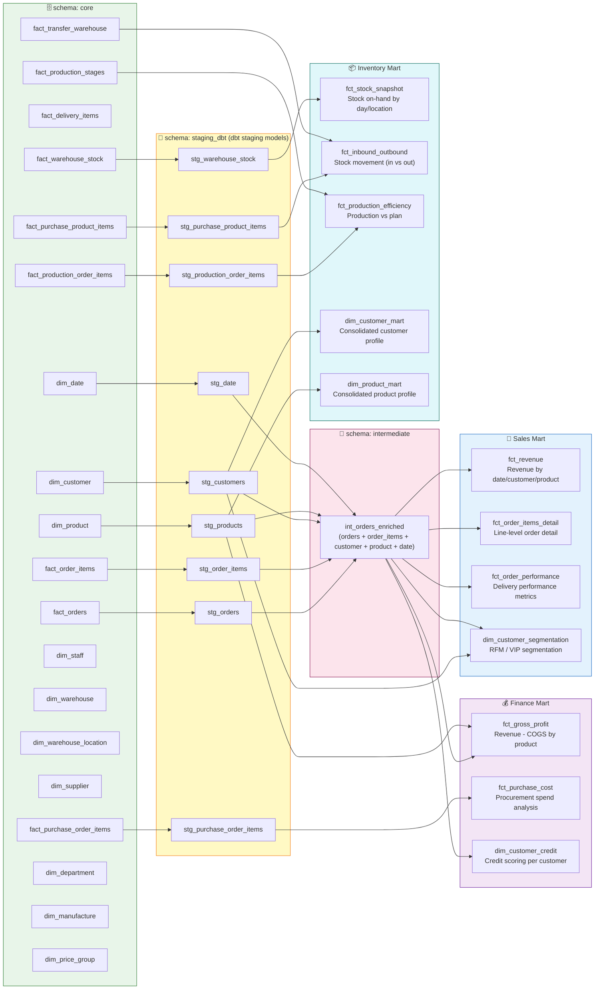
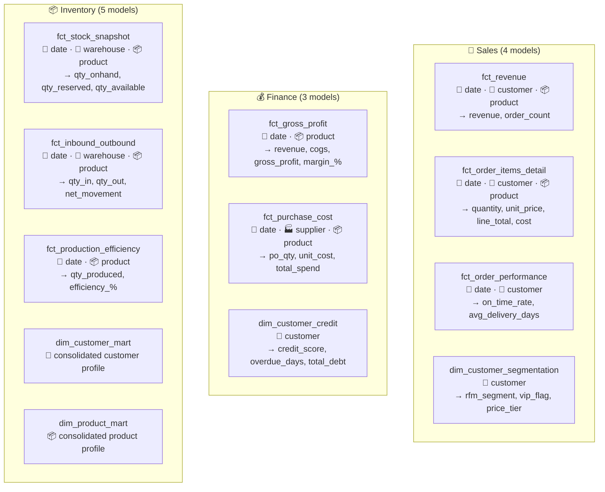

# dbt Mart Lineage

> Lineage từ `core.*` → `staging_dbt.*` → `mart.*`

```mermaid
flowchart LR

    %% ─── Core Layer ──────────────────────────────────────────────────
    subgraph CORE["🗄️  schema: core"]
        direction TB
        C_FO["fact_orders"]
        C_FOI["fact_order_items"]
        C_FDI["fact_delivery_items"]
        C_FWS["fact_warehouse_stock"]
        C_FPPI["fact_purchase_product_items"]
        C_FTW["fact_transfer_warehouse"]
        C_FPOI["fact_purchase_order_items"]
        C_FPROI["fact_production_order_items"]
        C_FPRS["fact_production_stages"]

        C_DC["dim_customer"]
        C_DP["dim_product"]
        C_DS["dim_staff"]
        C_DW["dim_warehouse"]
        C_DL["dim_warehouse_location"]
        C_DSup["dim_supplier"]
        C_DD["dim_date"]
        C_DDept["dim_department"]
        C_DM["dim_manufacture"]
        C_DPG["dim_price_group"]
    end

    %% ─── dbt Staging Views ───────────────────────────────────────────
    subgraph STG_DBT["🔧  schema: staging_dbt (dbt staging models)"]
        direction TB
        S_O["stg_orders"]
        S_OI["stg_order_items"]
        S_WS["stg_warehouse_stock"]
        S_FPPI["stg_purchase_product_items"]
        S_FPOI["stg_purchase_order_items"]
        S_FPROI["stg_production_order_items"]
        S_DC["stg_customers"]
        S_DP["stg_products"]
        S_DD["stg_date"]
    end

    %% ─── dbt Intermediate ────────────────────────────────────────────
    subgraph INT["🔧  schema: intermediate"]
        INT_OE["int_orders_enriched\n(orders + order_items + customer + product + date)"]
    end

    %% ─── Mart Layer ──────────────────────────────────────────────────
    subgraph MART_SALES["🛒  Sales Mart"]
        M_REV["fct_revenue\nRevenue by date/customer/product"]
        M_OID["fct_order_items_detail\nLine-level order detail"]
        M_OPF["fct_order_performance\nDelivery performance metrics"]
        M_CSG["dim_customer_segmentation\nRFM / VIP segmentation"]
    end

    subgraph MART_FIN["💰  Finance Mart"]
        M_GP["fct_gross_profit\nRevenue - COGS by product"]
        M_PC["fct_purchase_cost\nProcurement spend analysis"]
        M_CC["dim_customer_credit\nCredit scoring per customer"]
    end

    subgraph MART_INV["📦  Inventory Mart"]
        M_SS["fct_stock_snapshot\nStock on-hand by day/location"]
        M_IO["fct_inbound_outbound\nStock movement (in vs out)"]
        M_PE["fct_production_efficiency\nProduction vs plan"]
        M_DCM["dim_customer_mart\nConsolidated customer profile"]
        M_DPM["dim_product_mart\nConsolidated product profile"]
    end

    %% ─── Core → dbt Staging ──────────────────────────────────────────
    C_FO   --> S_O
    C_FOI  --> S_OI
    C_FWS  --> S_WS
    C_FPPI --> S_FPPI
    C_FPOI --> S_FPOI
    C_FPROI --> S_FPROI
    C_DC   --> S_DC
    C_DP   --> S_DP
    C_DD   --> S_DD

    %% ─── dbt Staging → Intermediate ──────────────────────────────────
    S_O  --> INT_OE
    S_OI --> INT_OE
    S_DC --> INT_OE
    S_DP --> INT_OE
    S_DD --> INT_OE

    %% ─── → Sales Mart ─────────────────────────────────────────────────
    INT_OE --> M_REV
    INT_OE --> M_OID
    INT_OE --> M_OPF
    S_DC   --> M_CSG
    INT_OE --> M_CSG

    %% ─── → Finance Mart ───────────────────────────────────────────────
    INT_OE --> M_GP
    S_DP   --> M_GP
    S_FPOI --> M_PC
    INT_OE --> M_CC

    %% ─── → Inventory Mart ─────────────────────────────────────────────
    S_WS   --> M_SS
    S_FPPI --> M_IO
    C_FTW  --> M_IO
    S_FPROI --> M_PE
    C_FPRS  --> M_PE
    S_DC   --> M_DCM
    S_DP   --> M_DPM

    style CORE      fill:#e8f5e9,stroke:#2e7d32
    style STG_DBT   fill:#fff9c4,stroke:#f57f17
    style INT       fill:#fce4ec,stroke:#880e4f
    style MART_SALES fill:#e3f2fd,stroke:#1565c0
    style MART_FIN  fill:#f3e5f5,stroke:#6a1b9a
    style MART_INV  fill:#e0f7fa,stroke:#00695c
```

## Danh sách model và nguồn tham chiếu

```mermaid
flowchart TD
    subgraph SALES_D["🛒 Sales (4 models)"]
        direction LR
        fct_revenue["fct_revenue\n📅 date · 👤 customer · 📦 product\n→ revenue, order_count"]
        fct_order_items_detail["fct_order_items_detail\n📅 date · 👤 customer · 📦 product\n→ quantity, unit_price, line_total, cost"]
        fct_order_performance["fct_order_performance\n📅 date · 👤 customer\n→ on_time_rate, avg_delivery_days"]
        dim_customer_segmentation["dim_customer_segmentation\n👤 customer\n→ rfm_segment, vip_flag, price_tier"]
    end

    subgraph FIN_D["💰 Finance (3 models)"]
        direction LR
        fct_gross_profit["fct_gross_profit\n📅 date · 📦 product\n→ revenue, cogs, gross_profit, margin_%"]
        fct_purchase_cost["fct_purchase_cost\n📅 date · 🏭 supplier · 📦 product\n→ po_qty, unit_cost, total_spend"]
        dim_customer_credit["dim_customer_credit\n👤 customer\n→ credit_score, overdue_days, total_debt"]
    end

    subgraph INV_D["📦 Inventory (5 models)"]
        direction LR
        fct_stock_snapshot["fct_stock_snapshot\n📅 date · 🏪 warehouse · 📦 product\n→ qty_onhand, qty_reserved, qty_available"]
        fct_inbound_outbound["fct_inbound_outbound\n📅 date · 🏪 warehouse · 📦 product\n→ qty_in, qty_out, net_movement"]
        fct_production_efficiency["fct_production_efficiency\n📅 date · 📦 product\n→ qty_produced, efficiency_%"]
        dim_customer_mart["dim_customer_mart\n👤 consolidated customer profile"]
        dim_product_mart["dim_product_mart\n📦 consolidated product profile"]
    end
```
