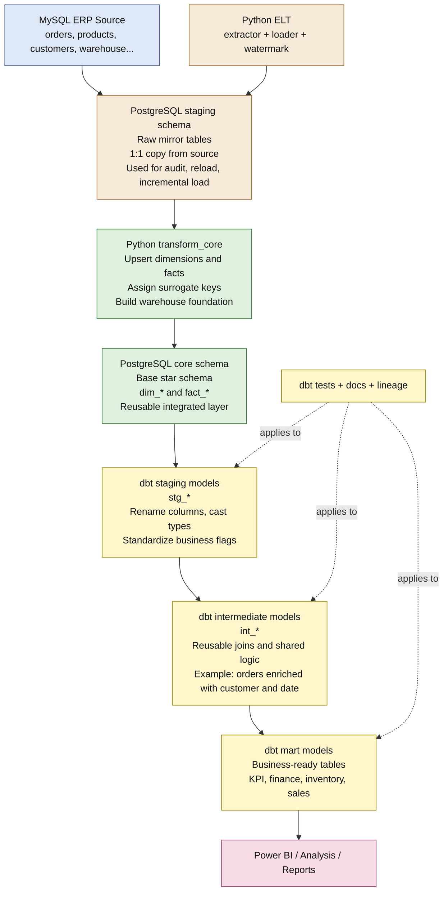
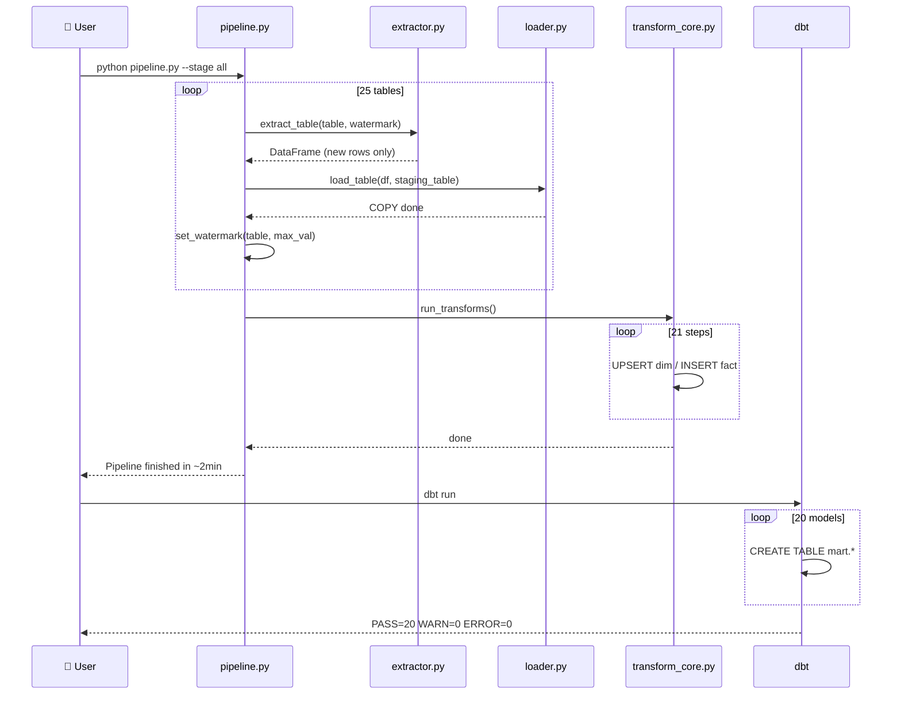

# Pipeline Architecture

## Ý nghĩa từng lớp

- `PostgreSQL.staging`: raw mirror từ ERP, phục vụ ingest, audit, reload và incremental load.
- `PostgreSQL.core`: lớp warehouse nền tảng, chuẩn hóa thành dimension/fact để tái sử dụng.
- `dbt stg_*`: semantic cleanup trên top của `core`, không phải raw staging của database.
- `dbt int_*`: gom các join và logic dùng chung để mart không lặp code.
- `dbt mart`: bảng sẵn sàng cho KPI, dashboard và phân tích nghiệp vụ.

## Thứ tự chạy

