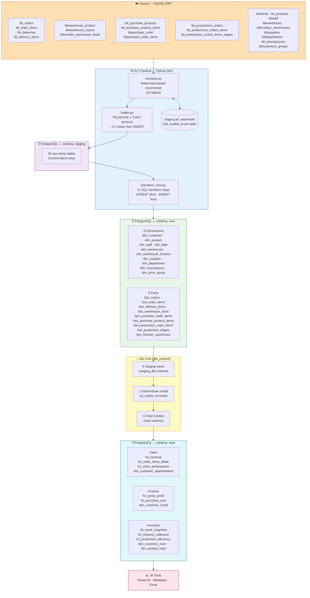
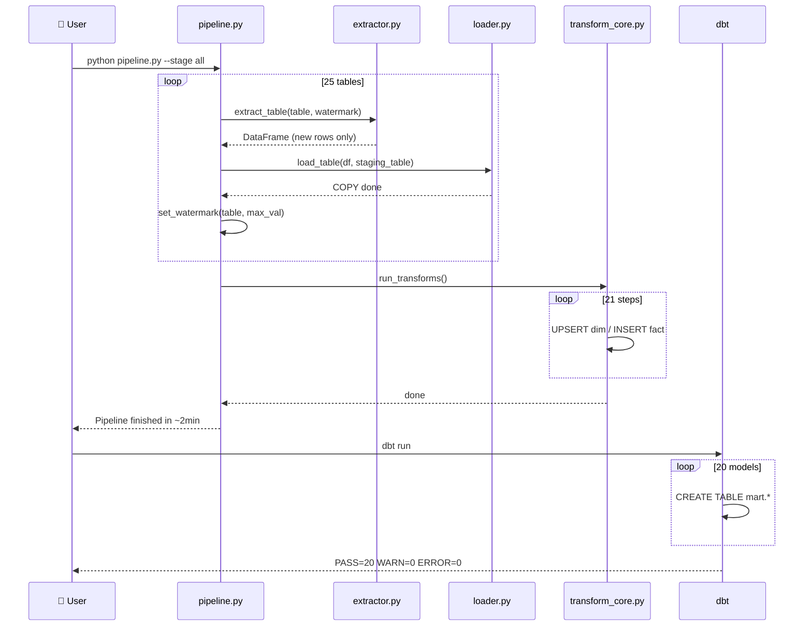

# Pipeline Architecture

```mermaid
flowchart TD
    subgraph SRC["☁️  Source — MySQL ERP"]
        direction TB
        M1["tbl_orders\ntbl_order_items\ntbl_deliveries\ntbl_delivery_items"]
        M2["tblwarehouse_product\ntblwarehouse_export\ntbltransfer_warehouse_detail"]
        M3["tbl_purchase_products\ntbl_purchase_product_items\ntblpurchase_order\ntblpurchase_order_items"]
        M4["tbl_productions_orders\ntbl_productions_orders_items\ntbl_productions_orders_items_stages"]
        M5["tblclients · tbl_products · tblstaff\ntblwarehouse · tbllocaltion_warehouses\ntblsuppliers · tbldepartments · tbl_manufactures\ntblcustomers_groups"]
    end

    subgraph ELT["⚙️  ELT Pipeline — Python (elt/)"]
        direction TB
        E1["extractor.py\nWatermark-based incremental\n(25 tables)"]
        E2["loader.py\nTRUNCATE + COPY protocol\n~17x faster than INSERT"]
        WM[("staging.etl_watermark\nlast_loaded_at per table")]
        E3["transform_core.py\n21 SQL transform steps\nUPSERT dims · INSERT facts"]
    end

    subgraph STG["🗄️  PostgreSQL — schema: staging"]
        S1["25 raw mirror tables\n(current batch only)"]
    end

    subgraph CORE["🗄️  PostgreSQL — schema: core"]
        direction LR
        D["10 Dimensions\ndim_customer · dim_product\ndim_staff · dim_date\ndim_warehouse · dim_warehouse_location\ndim_supplier · dim_department\ndim_manufacture · dim_price_group"]
        F["9 Facts\nfact_orders · fact_order_items\nfact_delivery_items · fact_warehouse_stock\nfact_purchase_order_items\nfact_purchase_product_items\nfact_production_order_items\nfact_production_stages\nfact_transfer_warehouse"]
    end

    subgraph DBT["🔧  dbt Core (dbt_project/)"]
        DBT1["8 Staging views\n(staging_dbt schema)"]
        DBT2["1 Intermediate model\nint_orders_enriched"]
        DBT3["12 Mart models\n(mart schema)"]
    end

    subgraph MART["🗄️  PostgreSQL — schema: mart"]
        direction LR
        MS["Sales\nfct_revenue\nfct_order_items_detail\nfct_order_performance\ndim_customer_segmentation"]
        MF["Finance\nfct_gross_profit\nfct_purchase_cost\ndim_customer_credit"]
        MI["Inventory\nfct_stock_snapshot\nfct_inbound_outbound\nfct_production_efficiency\ndim_customer_mart · dim_product_mart"]
    end

    BI["📊  BI Tools\nPower BI · Metabase · Excel"]

    SRC --> E1
    E1 <--> WM
    E1 --> E2
    E2 --> STG
    STG --> E3
    E3 --> CORE
    CORE --> DBT1
    DBT1 --> DBT2
    DBT2 --> DBT3
    DBT3 --> MART
    MART --> BI

    style SRC fill:#ffe0b2,stroke:#e65100
    style ELT fill:#e3f2fd,stroke:#1565c0
    style STG fill:#f3e5f5,stroke:#6a1b9a
    style CORE fill:#e8f5e9,stroke:#2e7d32
    style DBT fill:#fff9c4,stroke:#f57f17
    style MART fill:#e0f7fa,stroke:#00695c
    style BI  fill:#fce4ec,stroke:#880e4f
```

## Thứ tự chạy

```mermaid
sequenceDiagram
    participant U as 👤 User
    participant P as pipeline.py
    participant E as extractor.py
    participant L as loader.py
    participant T as transform_core.py
    participant D as dbt

    U->>P: python pipeline.py --stage all
    loop 25 tables
        P->>E: extract_table(table, watermark)
        E-->>P: DataFrame (new rows only)
        P->>L: load_table(df, staging_table)
        L-->>P: COPY done
        P->>P: set_watermark(table, max_val)
    end
    P->>T: run_transforms()
    loop 21 steps
        T->>T: UPSERT dim / INSERT fact
    end
    T-->>P: done
    P-->>U: Pipeline finished in ~2min

    U->>D: dbt run
    loop 20 models
        D->>D: CREATE TABLE mart.*
    end
    D-->>U: PASS=20 WARN=0 ERROR=0
```
