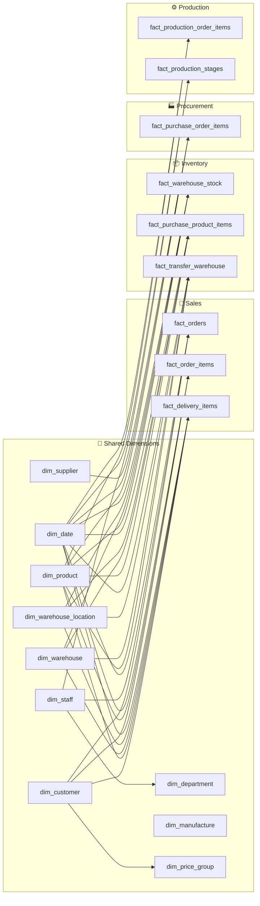

# Core Star Schema

> All 9 fact tables and 10 dimension tables in `schema: core`

```mermaid
erDiagram

    %% ─── Shared Dimensions ───────────────────────────────────────────
    dim_date {
        int     date_key        PK  "YYYYMMDD"
        date    full_date
        int     year
        int     quarter
        int     month
        int     week
        boolean is_weekend
    }

    dim_customer {
        int     customer_key    PK
        int     customer_id
        string  company
        string  representative
        string  city
        string  type_client
        string  vip_rating
        int     price_group_key FK
    }

    dim_product {
        int     product_key     PK
        int     product_id
        string  product_code
        string  product_name
        string  type_products
        string  brand
        decimal price_import
        decimal price_sell
    }

    dim_staff {
        int     staff_key       PK
        int     staff_id
        string  fullname
        string  role
        int     department_key  FK
    }

    dim_department {
        int     department_key  PK
        int     department_id
        string  department_name
    }

    dim_warehouse {
        int     warehouse_key   PK
        int     warehouse_id
        string  warehouse_code
        string  warehouse_name
    }

    dim_warehouse_location {
        int     location_key    PK
        int     location_id
        string  location_name
        int     warehouse_id
    }

    dim_supplier {
        int     supplier_key    PK
        int     supplier_id
        string  company
        string  address
    }

    dim_manufacture {
        int     manufacture_key PK
        int     manufacture_id
        string  manufacture_name
    }

    dim_price_group {
        int     price_group_key PK
        int     price_group_id
        string  price_group_code
        string  price_group_name
    }

    %% ─── Sales Facts ──────────────────────────────────────────────────
    fact_orders {
        int     order_id        PK
        int     customer_key    FK
        int     staff_key       FK
        int     order_date_key  FK
        int     delivery_date_key FK
        decimal total_amount
        string  status
    }

    fact_order_items {
        int     order_item_id   PK
        int     order_id
        int     customer_key    FK
        int     product_key     FK
        int     order_date_key  FK
        int     quantity
        decimal unit_price
        decimal line_total
    }

    fact_delivery_items {
        int     delivery_item_id PK
        int     customer_key    FK
        int     product_key     FK
        int     warehouse_key   FK
        int     location_key    FK
        int     delivery_date_key FK
        int     quantity_delivered
    }

    %% ─── Inventory Facts ──────────────────────────────────────────────
    fact_warehouse_stock {
        int     stock_key       PK
        int     product_key     FK
        int     warehouse_key   FK
        int     location_key    FK
        int     import_date_key FK
        decimal quantity_onhand
        decimal quantity_reserved
    }

    fact_purchase_product_items {
        int     purchase_item_id PK
        int     product_key     FK
        int     warehouse_key   FK
        int     location_key    FK
        int     import_date_key FK
        int     quantity
        decimal unit_cost
    }

    fact_transfer_warehouse {
        int     transfer_id     PK
        int     product_key     FK
        int     from_warehouse_key FK
        int     to_warehouse_key   FK
        int     from_location_key  FK
        int     to_location_key    FK
        int     transfer_date_key  FK
        int     quantity
    }

    %% ─── Procurement Facts ────────────────────────────────────────────
    fact_purchase_order_items {
        int     po_item_id      PK
        int     product_key     FK
        int     supplier_key    FK
        int     po_date_key     FK
        int     quantity_ordered
        decimal unit_cost
        decimal line_total
    }

    %% ─── Production Facts ─────────────────────────────────────────────
    fact_production_order_items {
        int     prod_item_id    PK
        int     product_key     FK
        int     prod_date_key   FK
        int     quantity_produced
    }

    fact_production_stages {
        int     stage_id        PK
        int     staff_key       FK
        int     stage_date_key  FK
        string  stage_name
        decimal duration_hours
    }

    %% ─── Dim-Dim relationships ────────────────────────────────────────
    dim_customer        }o--|| dim_price_group    : "price_group_key"
    dim_staff           }o--|| dim_department     : "department_key"

    %% ─── Sales cluster ────────────────────────────────────────────────
    fact_orders         }o--|| dim_customer       : "customer_key"
    fact_orders         }o--|| dim_staff          : "staff_key"
    fact_orders         }o--|| dim_date           : "order_date_key"

    fact_order_items    }o--|| dim_customer       : "customer_key"
    fact_order_items    }o--|| dim_product        : "product_key"
    fact_order_items    }o--|| dim_date           : "order_date_key"

    fact_delivery_items }o--|| dim_customer       : "customer_key"
    fact_delivery_items }o--|| dim_product        : "product_key"
    fact_delivery_items }o--|| dim_warehouse      : "warehouse_key"
    fact_delivery_items }o--|| dim_warehouse_location : "location_key"
    fact_delivery_items }o--|| dim_date           : "delivery_date_key"

    %% ─── Inventory cluster ────────────────────────────────────────────
    fact_warehouse_stock        }o--|| dim_product            : "product_key"
    fact_warehouse_stock        }o--|| dim_warehouse          : "warehouse_key"
    fact_warehouse_stock        }o--|| dim_warehouse_location : "location_key"
    fact_warehouse_stock        }o--|| dim_date               : "import_date_key"

    fact_purchase_product_items }o--|| dim_product            : "product_key"
    fact_purchase_product_items }o--|| dim_warehouse          : "warehouse_key"
    fact_purchase_product_items }o--|| dim_warehouse_location : "location_key"
    fact_purchase_product_items }o--|| dim_date               : "import_date_key"

    fact_transfer_warehouse     }o--|| dim_product            : "product_key"
    fact_transfer_warehouse     }o--|| dim_warehouse          : "from_warehouse_key"
    fact_transfer_warehouse     }o--|| dim_warehouse_location : "from_location_key"
    fact_transfer_warehouse     }o--|| dim_date               : "transfer_date_key"

    %% ─── Procurement cluster ──────────────────────────────────────────
    fact_purchase_order_items   }o--|| dim_product  : "product_key"
    fact_purchase_order_items   }o--|| dim_supplier : "supplier_key"
    fact_purchase_order_items   }o--|| dim_date     : "po_date_key"

    %% ─── Production cluster ───────────────────────────────────────────
    fact_production_order_items }o--|| dim_product : "product_key"
    fact_production_order_items }o--|| dim_date    : "prod_date_key"

    fact_production_stages      }o--|| dim_staff : "staff_key"
    fact_production_stages      }o--|| dim_date  : "stage_date_key"
```

## Sơ đồ phân nhóm theo miền

```mermaid
flowchart LR
    subgraph SHARED["🔷 Shared Dimensions"]
        DD["dim_date"]
        DC["dim_customer"]
        DP["dim_product"]
        DS["dim_staff"]
        DDept["dim_department"]
        DW["dim_warehouse"]
        DL["dim_warehouse_location"]
        DSup["dim_supplier"]
        DM["dim_manufacture"]
        DPG["dim_price_group"]
    end

    subgraph SALES["🛒 Sales"]
        FO["fact_orders"]
        FOI["fact_order_items"]
        FDI["fact_delivery_items"]
    end

    subgraph INVENTORY["📦 Inventory"]
        FWS["fact_warehouse_stock"]
        FPPI["fact_purchase_product_items"]
        FTW["fact_transfer_warehouse"]
    end

    subgraph PROCUREMENT["🏭 Procurement"]
        FPOI["fact_purchase_order_items"]
    end

    subgraph PRODUCTION["⚙️ Production"]
        FPROI["fact_production_order_items"]
        FPRS["fact_production_stages"]
    end

    DC --> FO & FOI & FDI
    DP --> FOI & FDI & FWS & FPPI & FTW & FPOI & FPROI
    DS --> FO & FPRS
    DW --> FDI & FWS & FPPI & FTW
    DL --> FDI & FWS & FPPI & FTW
    DD --> FO & FOI & FDI & FWS & FPPI & FTW & FPOI & FPROI & FPRS
    DSup --> FPOI
    DC --> DPG
    DS --> DDept
```
